<div align="center">




[](https://git.io/typing-svg)

[](https://github.com/Taiyakichan)
[](https://github.com/Taiyakichan?tab=followers)

</div>

## About Me

- Building Windows desktop tools and automation projects.
- Currently working on **Chiz Fishing Tools**, an NTE fishing helper.
- I like clean repositories, simple UX, neon UI, and anime-inspired polish.

## Featured Project

<div align="center">

[](https://github.com/Taiyakichan/Chiz-Fishing-Tools)

</div>

## Tech Stack

<p align="center">
  
  
  
  
  
</p>

## Profile Stats

<div align="center">


</div>

## Current Focus

```text
Project      Chiz Fishing Tools
Game         NTE
Platform     Windows
Stack        Python, OpenCV, CustomTkinter
Vibe         Neon desktop utility with anime-inspired polish
Goal         Keep tools simple, useful, and easy to run
```

<div align="center">


</div>
